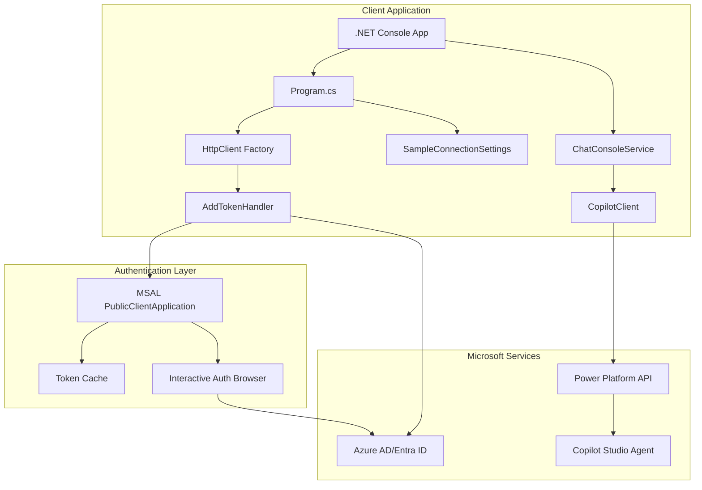
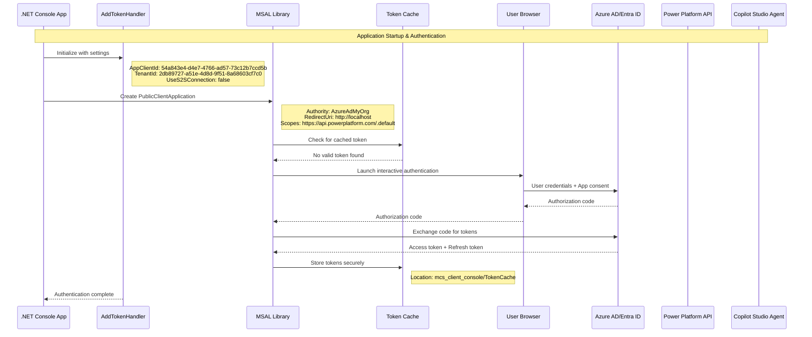
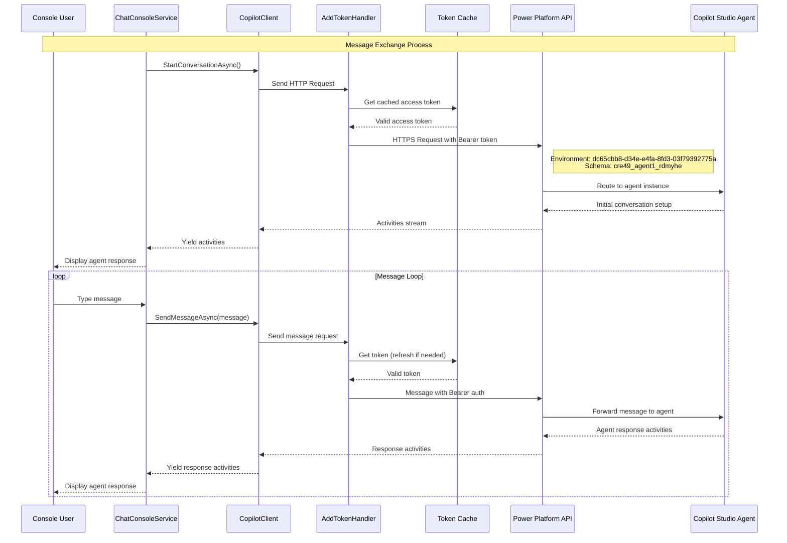
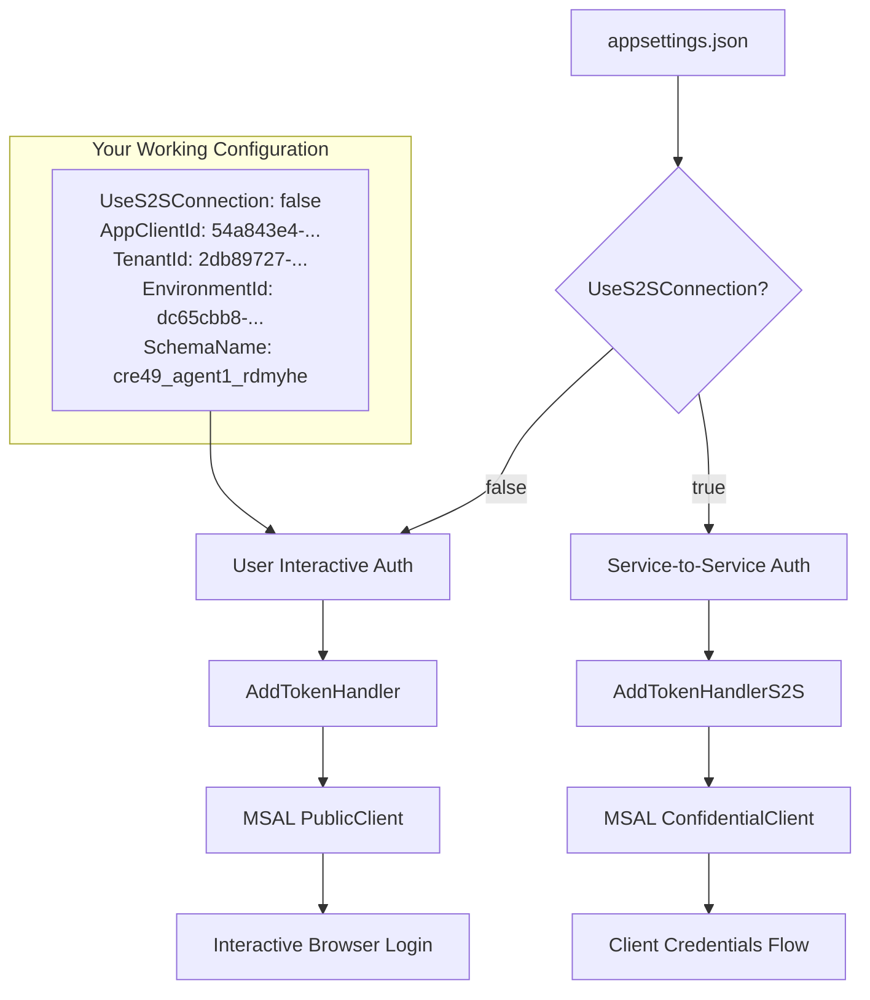
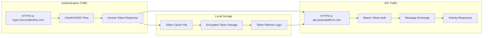

# Copilot Studio Client - Authentication & Message Flow

This document explains the traffic flow for authentication and message exchange in the Copilot Studio .NET client application.

## Architecture Overview

## Detailed Authentication Flow

## Message Exchange Flow

## Configuration Flow

## Network Traffic Overview

## Key Components

### Current Working Configuration:
- **Authentication Mode**: User Interactive (`UseS2SConnection: false`)
- **App Registration**: `54a843e4-d4e7-4766-ad57-73c12b7ccd5b`
- **Tenant**: `2db89727-a51e-4d8d-9f51-8a68603cf7c0`
- **Environment**: `dc65cbb8-d34e-e4fa-8fd3-03f79392775a`
- **Agent Schema**: `cre49_agent1_rdmyhe`

### Authentication Flow:
1. **MSAL Setup**: Creates PublicClientApplication with app registration details
2. **Token Cache**: Checks for existing valid tokens in local encrypted cache
3. **Interactive Auth**: Opens browser for user login if no valid token exists
4. **Token Storage**: Securely stores access and refresh tokens locally
5. **Request Authentication**: Adds Bearer token to all API requests

### Message Flow:
1. **Connection**: Establishes connection to Copilot Studio agent via Power Platform API
2. **Conversation Start**: Initiates conversation and receives initial activities
3. **Message Loop**: Continuous exchange of user messages and agent responses
4. **Activity Processing**: Handles various activity types (text, cards, etc.)

### Security:
- **Token Encryption**: Tokens stored encrypted in local file system
- **HTTPS Only**: All network communication over secure HTTPS
- **Token Refresh**: Automatic token refresh using stored refresh tokens
- **Scope Limitation**: Tokens scoped specifically to Power Platform API access
